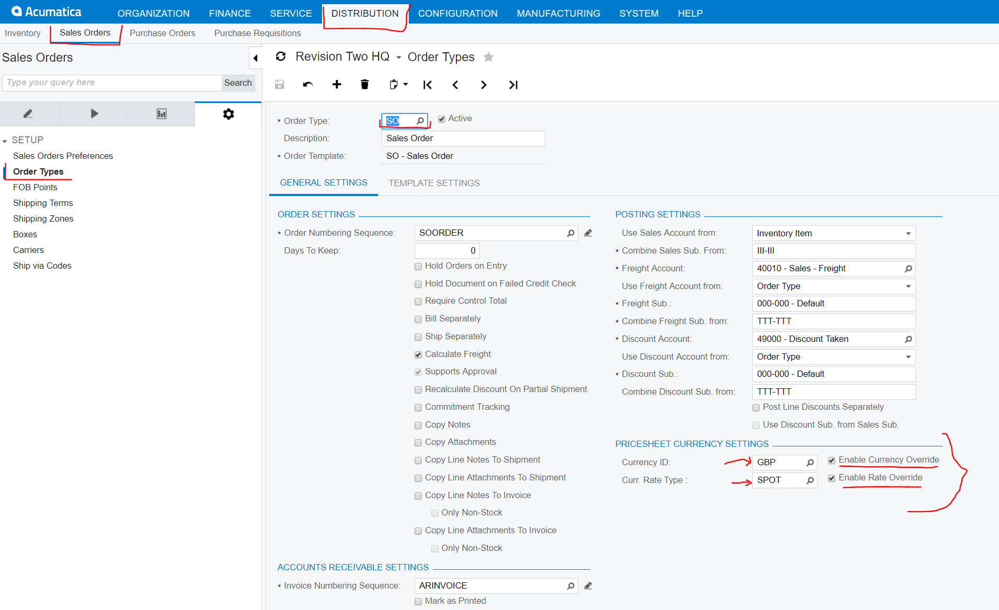
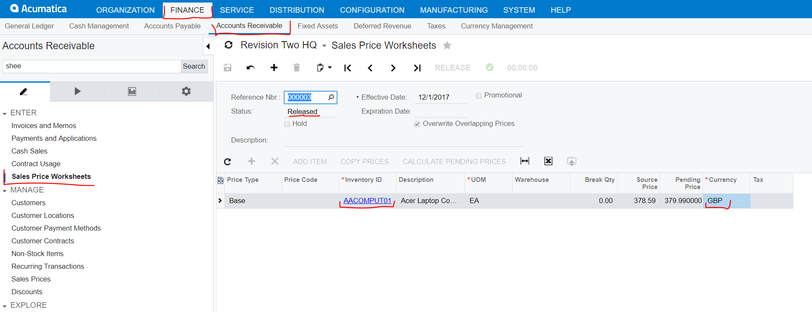
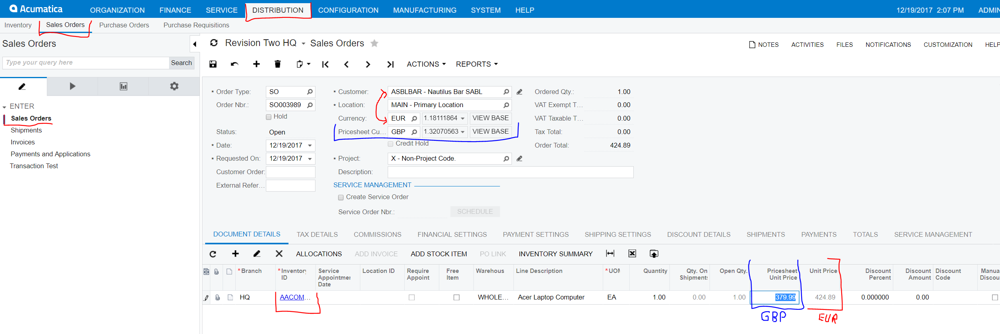
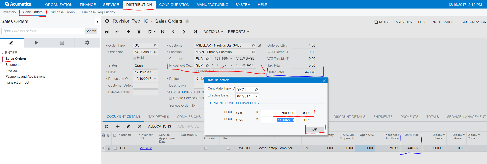
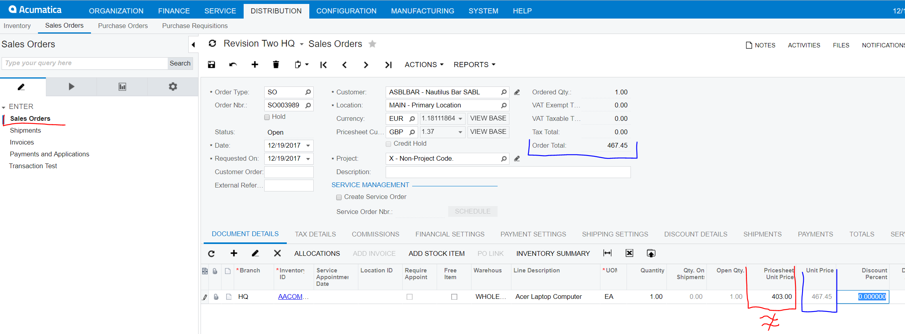
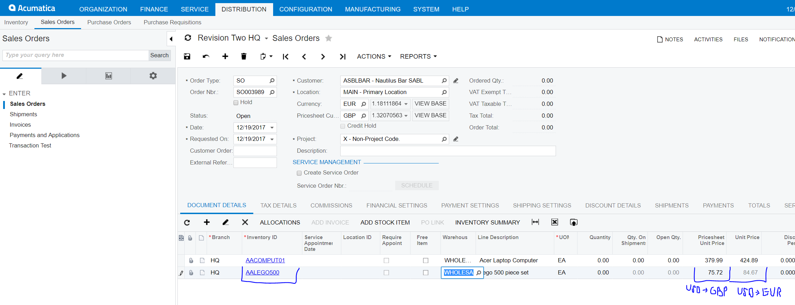
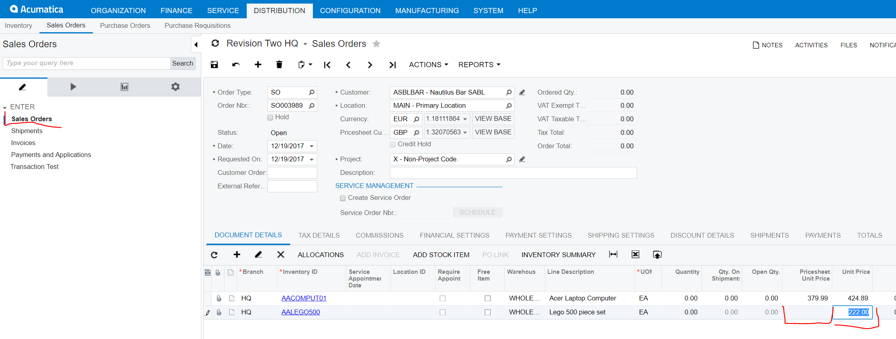
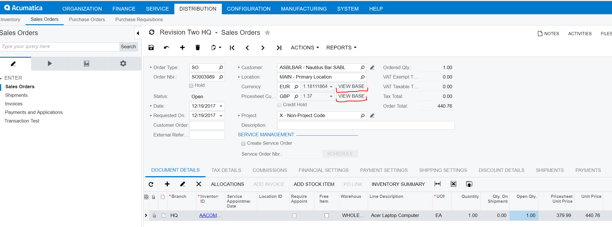
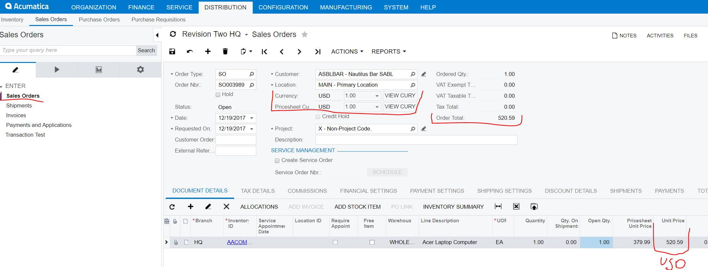

# PricesheetForeignCurrency
Handling price-sheet in a 3rd currency in Sales Orders:

### PricesheetForeignCurrency Settings

We have added a new section on the Order Types Screen (Distribution->Sales Orders->Configuration->Order Types) this section is named the Price Sheet Currency Settings.

On the Order type screen, select the SO Order Type (for sales order) and select the desired Currency ID, Select also the Curr. Rate Type.

You could also indicate if you want to let the users override Currency and/or override Rate. See sample below:

### Sales Price Worksheet

You can set your sales price sheet. On this example (as I did on the Price Sheet Currency Settings) I have added one Item with pricesheet price in GBP.

### Sales Order

On the sales order screen, we have added a Pricesheet Currency field to the Document Header (see below).

Also we have added a Pricesheet Unit Price field to the SOLine(details).

Please notice that our Acumatica instance has USD as Base Currency, but it could be any other Currency.

On this sample, I have selected a Customer with a EUR(Euro) Currency, this is the "Document Currency".

You can see that the Pricesheet Currency field defaulted to the GBP value set on the Order Type settings screen(explained above).

I have added the InventoryItem I have on my Sales Price Sheet, and it populates the Pricesheet Unit Price(from worksheet GBP) and shows the UnitPrice field in the Document Currency EUR.

### Updating Price Sheet Currency at Document's Level

In order to change the price sheet currency at document level just click on the price sheet currency dropdown and modify it as needed. ( This works just like the normal currency control)

As a result it will update both SOLines ( Unit Price) and the Document's Order Total on the header. See below.

### Updating Price Sheet Currency at Detail Line's Level

In order to change the price sheet currency at line level just click on the price sheet unit price field and modify it as needed.

As a result it will also update that Line (Unit Price) and the Document's Order Total on the header. See below.

### Adding Items that are not on the Sales Price Sheet

When adding items that are not on the sales price sheet it will work as usual, it will  grab the value(if any) from the Base and then convert it to the correct Currency for both PriceSheet Unit Price and Unit Price. (see below)

### Modifying the Unit Price field

The Customization Project disables the Unit Price field if the PriceSheet Unit Price Custom field has a value on it.

If you need to modify the Line Unit Price field just make sure the New Custom field has no value, then you could modify the Unit Price field. (see below)

### Clicking on View Base

You could also use the View Base button to show the Document on the Base Currency at any time.

### Viewing Base

